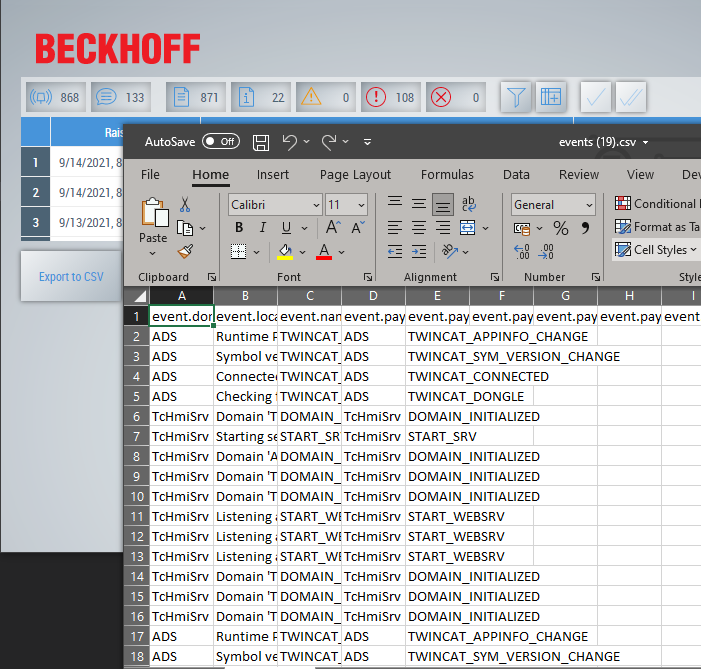
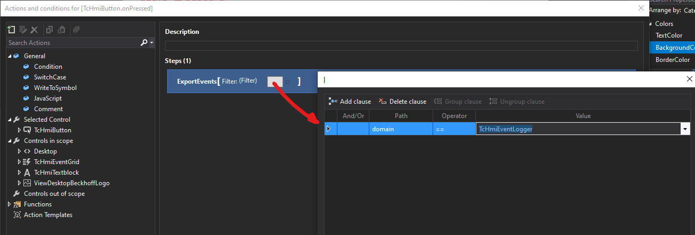

# Simple example of exporting events from TF2000 Event Logger

## Disclaimer
This is a personal guide not a peer reviewed journal or a sponsored publication. We make
no representations as to accuracy, completeness, correctness, suitability, or validity of any
information and will not be liable for any errors, omissions, or delays in this information or any
losses injuries, or damages arising from its display or use. All information is provided on an as
is basis. It is the reader’s responsibility to verify their own facts.

The views and opinions expressed in this guide are those of the authors and do not
necessarily reflect the official policy or position of any other agency, organization, employer or
company. Assumptions made in the analysis are not reflective of the position of any entity
other than the author(s) and, since we are critically thinking human beings, these views are
always subject to change, revision, and rethinking at any time. Please do not hold us to them
in perpetuity.

## Overview 
This is a proof of concept that you can export events from the TF2000 event logger.    

## Getting Started
You must open the project, open main.view, view using live view, then open live view in Chrome, Edge or Firefox. 
The save to CSV does not work in the mini live view built in to TwinCAT.   

## Screenshot


## Code Snippets
The following section of code is called on the "Export to CSV" button press.  You can add filters as an input argument if needed.  This can be done by editing the function call in the "onPressed" event.  The filter dialog will open when you attempt to change this setting.  All messages will be returned if you omit the filter.

```javascript
function ExportEvents(Filter) {

    if (TcHmi.Server.isWebsocketReady()) {

        var request = {
            'requestType': 'ReadWrite',
            'commands': [{
                "commandOptions": ["SendErrorMessage"],
                "symbol": "ListEvents",
                "orderBy": "timeRaised DESC",
                "filterMap": []
            }]
        };

        // make request for all events whos domain is TcHmiEventLogger 
        var defaultFilter = [{
                "path": "type",
                "comparator": "!=",
                "value": 2
            },
            {
                "logic": "AND"
            },
            [{
                "path": "domain",
                "comparator": "==",
                "value": "TcHmiEventLogger"
            }]
        ]

        // use either the passed in filter or use default filter
        request.commands[0].filter = Filter || defaultFilter;

        // send the request
        TcHmi.Server.request(request, function(data) {

            if (data.error !== TcHmi.Errors.NONE) {
                return;
            }
            var response = data.response;
            if (!response || response.error !== undefined) {
                return;
            }
            var command = response.commands[0];
            if (!command || command.error !== undefined) {
                return;
            }
            var events = command.readValue
            if (!events) {
                return;
            }

            // Uncomment here to see the content of an event.
            //console.log(events[0]);

            var csv = events.map(function(event) {
                return [
                    event.domain,
                    event.localizedString,
                    event.name,
                    event.payload.domain,
                    event.payload.name,
                    event.payload.params.data,
                    event.payload.params.eventClass,
                    event.payload.params.eventClassName,
                    event.payload.params.eventId,
                    event.payload.params.numArguments,
                    event.payload.params.sourceId,
                    event.payload.params.sourceName,
                    event.payload.params.targetName,
                    event.payload.params.types,
                    event.payload.severity,
                    event.payload.timeRaised,
                    event.payloadType,
                    event.timeReceived
                ];
            })

            // add the header fields
            var header = [
                "event.domain",
                "event.localizedString",
                "event.name",
                "event.payload.domain",
                "event.payload.name",
                "event.payload.params.data",
                "event.payload.params.eventClass",
                "event.payload.params.eventClassName",
                "event.payload.params.eventId",
                "event.payload.params.numArguments",
                "event.payload.params.sourceId",
                "event.payload.params.sourceName",
                "event.payload.params.targetName",
                "event.payload.params.types",
                "event.payload.severity",
                "event.payload.timeRaised",
                "event.payloadType",
                "event.timeReceived"
            ];

            csv.unshift(header);

            // convert to string
            var csv_as_string = csv.join('\r\n');
            var file = new Blob([csv_as_string]);
            var url = URL.createObjectURL(file);
            var element = document.createElement("a");

            element.setAttribute('href', url);
            element.setAttribute('download', "events.csv");
            element.style.display = 'none';

            document.body.appendChild(element);
            element.click();
            document.body.removeChild(element);

            setTimeout(function() {
                URL.revokeObjectURL(url);
            }, 1000 * 60);

        });
    }

}
```
## Changing the filter


## Versions
* TcXaeShell 3.1.4024.17
* TE2000 1.12.746.3

## Need more help?
Please visit http://beckhoff.com/ for further guides
